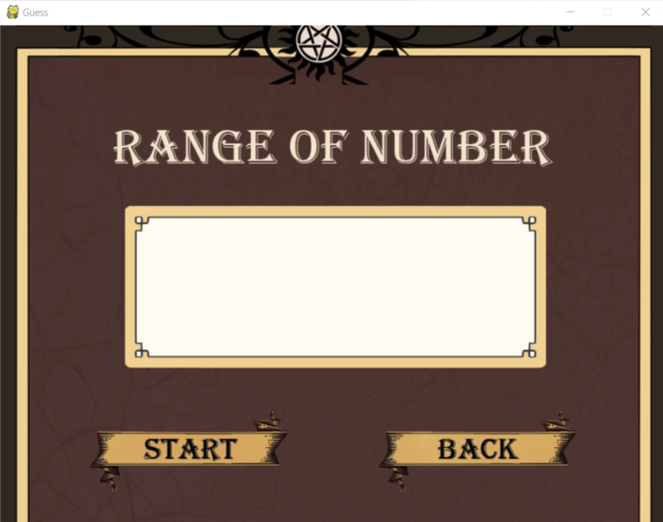

Guess
=============
Guess เป็นโปรเจคที่กลุ่มนักศึกษามหาวิทยาลัยเชียงใหม่ชั้นปีที่ 1 รหัส 59 ทำขึ้นมาใน รายวิชา 204113 [Principles of Computing] เพื่อนำความรู้ความเข้าใจในการศึกษาทั้งหมดที่เรียนมาในชั้นปีที่ 1 และการหาความรู้ด้วยตัวเองเพิ่มเติมมาประยุกต์ใช้กับการทำผลงานด้วยตนเอง เพื่อเป็นจุดเริ่มต้นและแนวทางในการพัฒนาโปรแกรมต่อไปในอนาคต

อะไรคือ Guess?
--------------
Guess เป็นโปรแกรมเกมส์ทายตัวเลขในใจของผู้เล่น และมีระบบ AI การสั่งการด้วยเสียงในการควบคุมการเล่นเกมส์ของผู้เล่น

หากต้องการให้โปรแกรมนี้มีการพัฒนาต่อยอดในด้านต่างๆ สามารถ fork แล้วสร้าง pull request มาได้เลยครับ

#### Folk & Clone
  1. กดปุ่ม fork ที่อยู่ทางด้านขวามือหน้าเวป github
	2. หลังจากนั้นคุณก็จะมีก๊อปปี้ของโปรเจคนี้อยู่ที่ git account ของตัวเอง เช่น https://github.com/yourname-git-account/Project204113
	3. เปิด drive ที่คุณต้องการเก็บข้อมูล
	4. เปิด terminal เพื่อใช้งาน git command
	5. ทำการ clone โปรเจคจาก git account ของตัวเองมาไว้ที่เครื่อง ด้วยคำสั่ง
```
$ git clone https://github.com/yourname-git-account/Project204113
```
6. ตอนนี้คุณก็มีโปรเจคอยู่ที่เครื่องของตัวเองเรียบร้อยแล้ว และสามารถพัฒนาต่อได้
7. ขั้นตอนอื่นๆในการใช้งาน git คุณสามารถศึกษาได้บนอินเทอร์เน็ต
#### Pull request
ในลำดับต่อไป คือการขอ pull request เพื่อให้รวมเอาข้อมูลที่คุณได้แก้ไขและพัฒนาไป รวมเข้ากับ โปรเจคหลัก
  1. กดสร้าง pull request จากหน้าเวป เพื่อขอนำเอาสิ่งที่คุณได้ทำไป ไปรวมเข้ากับโปรเจค พร้อมกับบอกรายละเอียดต่างๆที่ได้แก้ไขไป
  2. หากทุกอย่างโอเค สิ่งที่คุณได้แก้ไขไปก็จะถูกรวมเข้าไปยังโปรเจค :)
ปล. แน่นอนว่า ทุกๆอย่างในโปรเจคนี้แก้ไขและปรับปรุงให้ดีขึ้นได้ แม้กระทั่ง readme.md ไฟล์นี้ ถ้าคุณคิดว่ายังขาดส่วนใดไป ก็สามารถเพิ่มเติมและแก้ไขได้เช่นกัน

โปรแกรมที่จำเป็นต้องใช้
-----------------
* [Python 3.6](https://www.python.org/)
  #### ติดตั้ง Module สำหรับการใช้งานในโปรแกรม
  * **Pygame** เป็นโมดูลสำหรับแสดงผลหน้าต่างการสร้างเกม ติดตั้งด้วยคำสั่ง :
  ```
  $ pip install pygame
  ```
  
  * **SpeechRecognition** เป็นเทคโนโลยีที่ทำให้คอมพิวเตอร์รู้จำเสียงมนุษย์ เพื่อแปลงเสียงมนุษย์เป็นคำสั่งให้คอมพิวเตอร์เข้าใจ
  ในการใช้งาน Speech recognition ด้วย Google Speech Recognition API (รองรับภาษาไทย) สามารถติดตั้งได้ง่าย ๆ โดยใช้ด้วยคำสั่ง :
  ```
  $ pip install SpeechRecognition
  ```
  
  โมดูล SpeechRecognition ต้องการโมดูล **PyAudio** ด้วยครับ สามารถติดตั้งได้โดยใช้คำสั่ง
  ```
  $ pip install PyAudio
  ```
  
  * **gTTS** เป็นโมดูลที่ดึง Google TTS (Text-to-Speech) API เข้ามาใช้งาน โดยจะสร้างไฟล์เสียงสังเคราะห์ขึ้นมาในรูปแบบ mp3 ไม่จำกัดความยาว รองรับภาษาต่าง ๆ รวมถึงภาษาไทยด้วย (เวลาใช้งานต้องเรียกใช้อินเทอร์เน็ต) สามารถติดตั้งได้ด้วยคำสั่ง :
  ```
  $ pip install gTTS
  ```
  
  * **Pyglet** เป็นโมดูลสำหรับสร้างเกมบน Python เราสามารถนำความสามารถในการเล่นไฟล์เสียง .mp3 .ogg .WMA ของโมดูล Pyglet มาใช้งานเล่นไฟล์เสียงใน Python ได้ครับ สามารถติดตั้งได้ด้วยคำสั่ง :
  ```
  $ pip install pyglet
  ```
    ในการเล่นไฟล์เสียงด้วย Pyglet นี้ ผู้อ่านต้องติดตั้ง audio decoding library ที่มีชื่อว่า [AVbin](https://avbin.github.io/AVbin/Download.html)
    
    -หากพบปัญหาจากการใช้งาน AVbin  
    Error `AVbin is required to decode compressed media` หรือ `ImportError: Library "avbin" not found.`
    
    -*วิธีการแก้ไขปัญหา* (สำหรับผู้ใช้ Windows!) :  
    ไปที่โฟลเดอร์ที่ติดตั้ง AVbin `C:\Windows\System32` หาไฟล์ที่ชื่อ `avbin.dll` (หรือ `avbin64.dll` ถ้าคุณเป็นระบบปฏิบัติการ 64 บิต) จากนั้น cut และ paste ลงไปในโฟลเดอร์ `C:\Windows\SysWOW64`

การใช้งาน
---------------
เปิดโฟลเดอร์ที่ได้ clone มา แล้วพิมพ์คำสั่งบน terminal หรือ command-line และรันคำสั่ง :
```
$ python3 Project.py
```
<div align="center"></div>

#### วิธีการเล่น  (มีอธิบายอยู่ในเกมส์เป็นภาษาอังกฤษ)

1. ให้ผู้เล่นกำหนดช่วง 1 ถึง ตัวเลขที่คุณต้องการ(สูงสุด 127) แล้วพิมพ์ป้อนตัวเลขลงไป หรือสามารถสั่งการด้วยเสียงได้ในหน้านี้ 
<div align="center"></div>

    1.1. การสั่งการด้วยเสียง ให้พูดว่า `หวัดดีไซมอน`
    1.2. จากนั้นรอ animation เคลื่อนไหวเสร็จจะมีเสียงขึ้นมาพร้อมให้พูดต่อ
    1.3. ให้พูดว่า `ใส่ตัวเลขหน่อย` และรอระบบประมวลผลคำสั่ง(เมื่อภาพเคลื่อนไหวจนนิ่งและมีเสียงขึ้นมาพร้อมให้พูดต่อ) หากคำสั่งไม่ถูกต้องระบบจะให้พูดใหม่อีกครั้ง
    1.4. เมื่อพูดคำสั่งเสร็จ AI Simon จะพูดโต้ตอบกลับมาว่า `โอเค คุณต้องการใส่หมายเลขอะไรคะ` หลังจากนั้นให้พูดตัวเลขตามต้องการ(สูงสุด 127) หากเกินระบบจะให้พูดใหม่อีกครั้ง
2. ให้ผู้เล่นคิดตัวเลขไว้ในใจ 1 ตัวเลข ในช่วง 1 - ตัวเลขที่คุณป้อน (ยกตัวอย่าง ป้อน 63 ให้คิดตัวเลขในใจ ภายใน 1 ถึง 63 เป็นต้น)
3. หลังจากนั้นเกมส์จะเข้าสู่การทายตัวเลข จากการสุ่มตัวเลขและแสดงผลออกมา แล้วให้ผู้เล่นกด yes (ถ้ามีตัวเลขในหน้านี้) กด no (ถ้าไม่มีตัวเลข)
<div align="center"></div>

		ปล. ในหน้าสำหรับกด yes no สามารถเรียก AI Simon ได้ด้วยการพูดว่า `หวัดดีไซมอน` รอ animation เคลื่อนไหวเสร็จจะมีเสียงขึ้นมาพร้อมให้พูดต่อ
		ขั้นตอนต่อไปให้พูดว่า `ช่วยกด yen no ให้หน่อย` รอระบบประมวลผลคำสั่ง หากคำสั่งไม่ถูกต้องจะให้พูดใหม่อีกครั้ง หลังจากนั้นทำตามระบบโต้ตอบ AI Simon
4. เมื่อเสร็จสิ้นจากการตอบ yes no เกมส์จะทายตัวเลขที่ผู้เล่นคิดไว้ในใจนั้นออกมา

Contributors
--------------------
* 590510534 นางสาวจิรนันท์	  พหลธรรมศาล	 [JiranunEARN](https://github.com/JiranunEARN)
* 590510538 นายณฐกร				ภักดียนต์เจริญ	 [nathakorn-l](https://github.com/nathakorn-l)
* 590510555 นายนนท์ปวิธ			ยศวงศ์รัศมี			[Nonpawit-Yotwongratsamee](https://github.com/Nonpawit-Yotwongratsamee)
* 590510558	นายบริรัฐ				 คำปิงยศ			 [borirat-k](https://github.com/borirat-k)
* 590510579	นายวัชรากรณ์		 ยิ่งเจริญ			 [JemJayz](https://github.com/Watcharakorn-ying)


